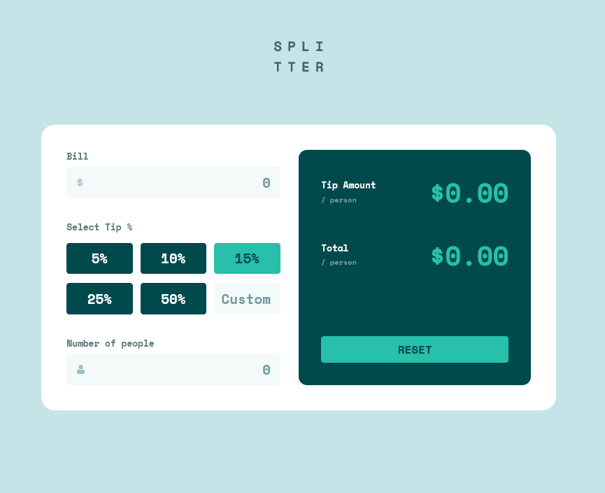
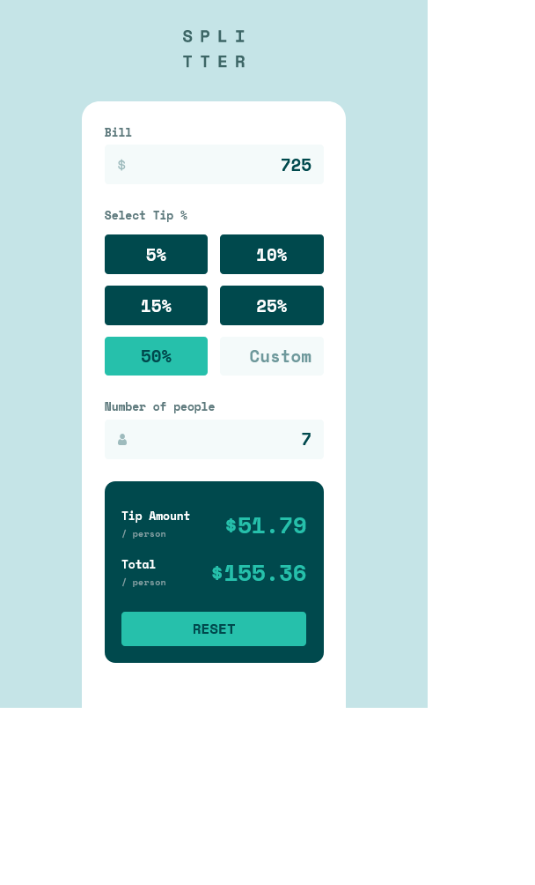

# Frontend Mentor - Tip calculator app

## Table of contents

  - [The challenge](#the-challenge)
  - [Screenshot](#screenshot)
  - [Links](#links)
  - [Author](#author)

## The challenge

Your challenge is to build out this tip calculator app and get it looking as close to the design as possible.

You can use any tools you like to help you complete the challenge. So if you've got something you'd like to practice, feel free to give it a go.

Your users should be able to:

- View the optimal layout for the app depending on their device's screen size
- See hover states for all interactive elements on the page
- Calculate the correct tip and total cost of the bill per person

### Screenshot

### Links

- Solution URL: https://github.com/gdcristea/tip-calculator-app

- Live Site URL: https://gdcristea.github.io/tip-calculator-app/

## Author

- Linkedin - [Daniel Cristea](https://www.linkedin.com/in/daniel-cristea-629069191/)

- Frontend Mentor - [@gdcristea](https://www.frontendmentor.io/profile/gdcristea)

- Twitter - [@gdcristea10](https://twitter.com/gdcristea10)